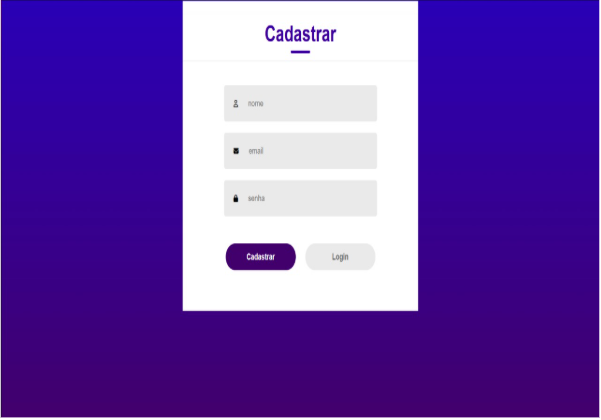
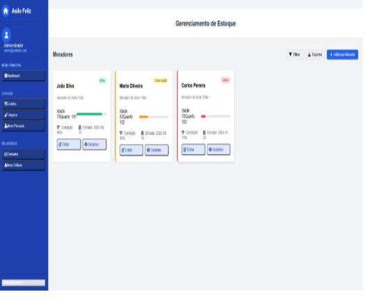

# 🖥️ Projeto de Interface

## 📌 Pré-requisitos

Este projeto de interface foi desenvolvido com base na **Especificação do Projeto**, atendendo aos requisitos funcionais, não funcionais e às histórias de usuário identificadas anteriormente.

## 👤 Visão Geral da Interação do Usuário

A navegação pelo sistema foi pensada para ser **intuitiva**, **rápida** e **acessível**. As interfaces foram desenhadas para facilitar a jornada do usuário desde o primeiro acesso até a finalização das ações desejadas, como registrar uma solicitação ou acompanhar seu andamento.

O sistema é dividido em módulos principais, cada um acessível por menus claros e responsivos.

## 🧩 Telas Principais

As principais interfaces da plataforma incluem:

### 🔐 Tela de Login

- Entrada com e-mail e senha.
- Validação de acesso.
- Redirecionamento para a tela principal após autenticação.

### 🏠 Tela Inicial (Dashboard)

- Visão geral das solicitações.
- Status de cada processo (em andamento, finalizado, pendente).
- Acesso rápido aos principais módulos do sistema.

### 📝 Tela de Nova Solicitação

- Formulário estruturado para inserção de dados.
- Seleção de tipo de solicitação.
- Geração automática de protocolo.

### 📋 Tela de Acompanhamento

- Listagem das solicitações do usuário.
- Filtros por status, data ou tipo.
- Visualização de detalhes da solicitação.

### ⚙️ Tela Administrativa

- Acesso restrito a usuários com perfil de administrador.
- Gestão de usuários, tipos de solicitação e indicadores.

## 🧠 Elaboração das Interfaces

As interfaces foram elaboradas a partir de:

- **Requisitos Funcionais**: Cada tela implementa funcionalidades descritas como obrigatórias no escopo do projeto, como criação e visualização de solicitações.
- **Requisitos Não Funcionais**: Foco em usabilidade, performance e responsividade, garantindo acesso tanto em desktop quanto em dispositivos móveis.
- **Histórias de Usuário**: Cada interface foi desenhada pensando na experiência real do usuário, com foco em **facilidade de uso**, **fluxo lógico** e **redução de etapas desnecessárias**.

## 🧪 Protótipo Interativo

Os wireframes foram desenvolvidos com base nos fluxos definidos na modelagem TO-BE e estão disponíveis em formato interativo.

## Diagrama de fluxo

## Wireframes e Interface do sistema

### Tela principal do sistema

###  Telas do cadastro

### Tela de Login

### Telas de lista de itens

### Tela de gestão

