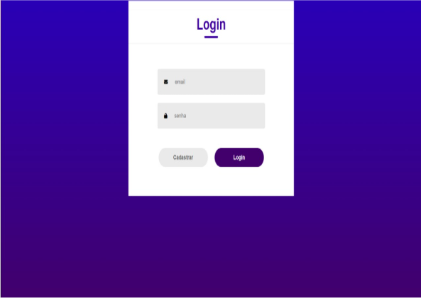
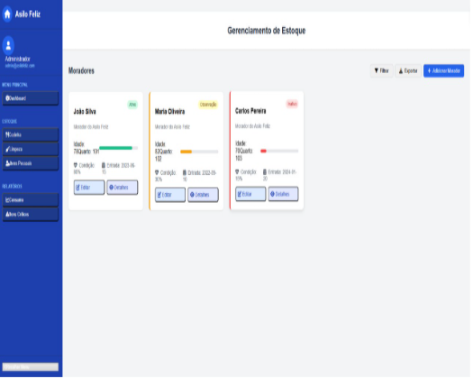
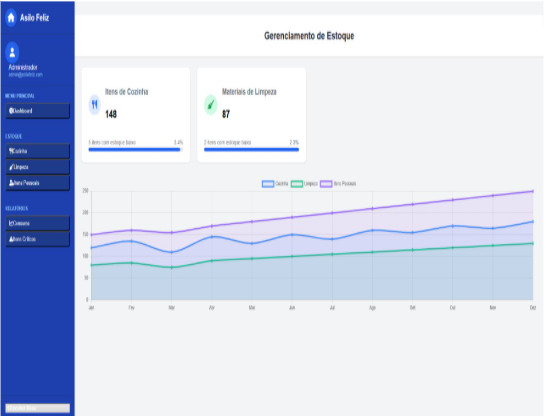

# Template padrão da aplicação

Será usado telas com descrições literais do que cada modulo pode realizar, responsivo, e seguindo um padrão como nas imagens a seguir :

## Exemplo 1

## Exemplo 2 

## Exemplo 3 

