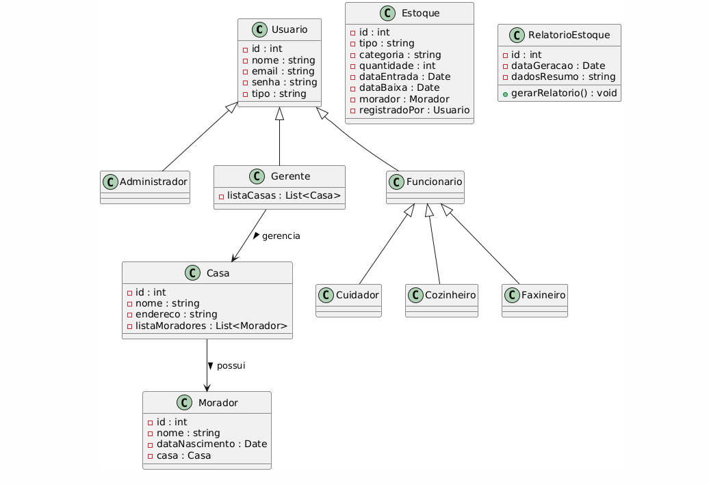
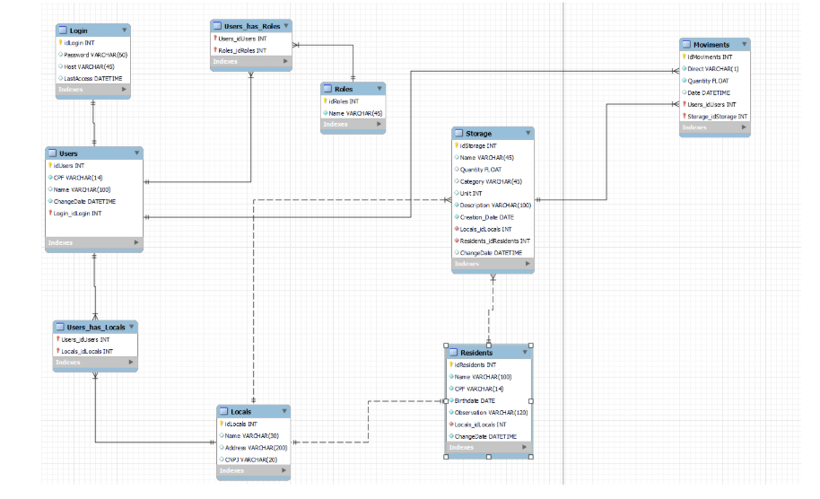
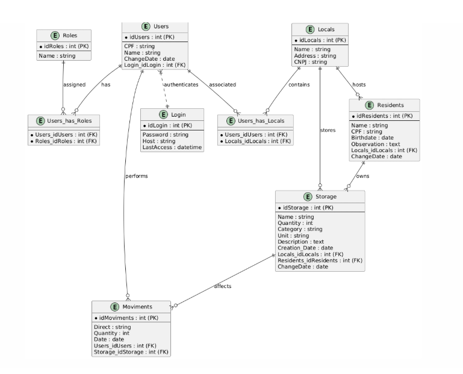

# Arquitetura da solução

## Segue conforme o planejamento as seguintes tecnologias : 
Front-end: HTML, JavaScript e CSS, garantindo uma interface simples e responsiva.

Back-end: C# com ASP.NET, proporcionando segurança e facilidade na integração com o banco de dados.

Banco de Dados: PostgreSQL, pela robustez e compatibilidade com a aplicação.

Hospedagem: Serviço de Web Hosting com suporte a aplicações .NET e banco SQL. (Provedor não escolhido ainda)

## Diagrama de classes



##  Modelo de dados



### Modelo ER


 
### Modelo físico

Insira aqui o script de criação das tabelas do banco de dados.

Veja um exemplo:

```sql
-- Criação da tabela Medico
CREATE TABLE Medico (
    MedCodigo INTEGER PRIMARY KEY,
    MedNome VARCHAR(100)
);

-- Criação da tabela Paciente
CREATE TABLE Paciente (
    PacCodigo INTEGER PRIMARY KEY,
    PacNome VARCHAR(100)
);

-- Criação da tabela Consulta
CREATE TABLE Consulta (
    ConCodigo INTEGER PRIMARY KEY,
    MedCodigo INTEGER,
    PacCodigo INTEGER,
    Data DATE,
    FOREIGN KEY (MedCodigo) REFERENCES Medico(MedCodigo),
    FOREIGN KEY (PacCodigo) REFERENCES Paciente(PacCodigo)
);

-- Criação da tabela Medicamento
CREATE TABLE Medicamento (
    MdcCodigo INTEGER PRIMARY KEY,
    MdcNome VARCHAR(100)
);

-- Criação da tabela Prescricao
CREATE TABLE Prescricao (
    ConCodigo INTEGER,
    MdcCodigo INTEGER,
    Posologia VARCHAR(200),
    PRIMARY KEY (ConCodigo, MdcCodigo),
    FOREIGN KEY (ConCodigo) REFERENCES Consulta(ConCodigo),
    FOREIGN KEY (MdcCodigo) REFERENCES Medicamento(MdcCodigo)
);
```
Esse script deverá ser incluído em um arquivo .sql na pasta [de scripts SQL](../src/db).


## Tecnologias
A implantação da aplicação será realizada em um ambiente único, hospedado em um serviço de web hosting que suportará a execução completa do sistema, incluindo front-end, back-end e banco de dados.


- Tecnologias utilizadas:

Front-end: HTML, JavaScript e CSS, garantindo uma interface simples e responsiva.
Back-end: C# com ASP.NET, proporcionando segurança e facilidade na integração com o banco de dados.
Banco de Dados: PostgreSQL, pela robustez e compatibilidade com a aplicação.
Hospedagem: Serviço de Web Hosting com suporte a aplicações .NET e banco SQL. (Provedor não escolhido ainda)


| **Dimensão**   | **Tecnologia**  |
| ---            | ---             |
| Front-end      | HTML + CSS + JS + React |
| Back-end       | C# ASP.NET         |
| SGBD           | SQL          |
| Desenvolvimento         | VS Code          |


## Hospedagem

Estamos analisando a melhor forma de hospedar que seja eficiente e entregue uma bom desempenho aos usuários.

## Qualidade de software

Conceituar qualidade é uma tarefa complexa, mas pode ser vista como um método gerencial que, por meio de procedimentos disseminados por toda a organização, busca garantir um produto final que satisfaça às expectativas dos stakeholders.

No contexto do desenvolvimento de software, qualidade pode ser entendida como um conjunto de características a serem atendidas, de modo que o produto de software atenda às necessidades de seus usuários. Entretanto, esse nível de satisfação nem sempre é alcançado de forma espontânea, devendo ser continuamente construído. Assim, a qualidade do produto depende fortemente do seu respectivo processo de desenvolvimento.

## Norma ISO/IEC 25010

A norma internacional ISO/IEC 25010, que é uma atualização da ISO/IEC 9126, define oito características principais e 30 subcaracterísticas de qualidade para produtos de software. Essas características abrangem aspectos como funcionalidade, usabilidade, confiabilidade, eficiência, mantenibilidade, portabilidade, segurança e compatibilidade.

## Subcaracterísticas Selecionadas para o Projeto

Considerando os objetivos do nosso projeto e aspectos simples de qualidade que queremos priorizar, nossa equipe optou por focar nas seguintes subcaracterísticas da ISO/IEC 25010:

- **Funcionalidade - Adequação Funcional:** para garantir que o software entregue as funções necessárias e esperadas pelo usuário.
- **Usabilidade - Operabilidade:** para assegurar que o software seja fácil de operar e aprender, melhorando a experiência do usuário.
- **Confiabilidade - Tolerância a Falhas:** para que o software continue funcionando mesmo em situações inesperadas.
- **Eficiência - Desempenho:** para que o software responda rapidamente e utilize os recursos de forma otimizada.
- **Mantenibilidade - Modularidade:** para facilitar a atualização e manutenção futura do sistema.

## Justificativa das Escolhas

Essas subcaracterísticas foram escolhidas porque refletem diretamente as expectativas dos usuários finais e da equipe de desenvolvimento. A adequação funcional garante que o software entregue valor, enquanto a usabilidade assegura que os usuários consigam utilizar o sistema sem dificuldades. A confiabilidade e a eficiência impactam na robustez e na satisfação do cliente, reduzindo interrupções e melhorando a performance. Por fim, a modularidade é essencial para que o software possa evoluir sem grandes esforços ou riscos.

## Métricas para Avaliação

| Subcaracterística      | Métrica                                  | Descrição                                    |
|-----------------------|-----------------------------------------|----------------------------------------------|
| Adequação Funcional   | % de requisitos implementados           | Porcentagem dos requisitos funcionais atendidos |
| Operabilidade         | Tempo médio para aprendizado do usuário | Tempo necessário para um novo usuário operar o sistema com proficiência |
| Tolerância a Falhas   | Taxa de falhas críticas por período     | Número de falhas que causam interrupções críticas |
| Desempenho            | Tempo médio de resposta                  | Tempo que o sistema leva para responder a uma solicitação |
| Modularidade          | Número de módulos independentes          | Quantidade de módulos ou componentes separados que facilitam manutenção |
